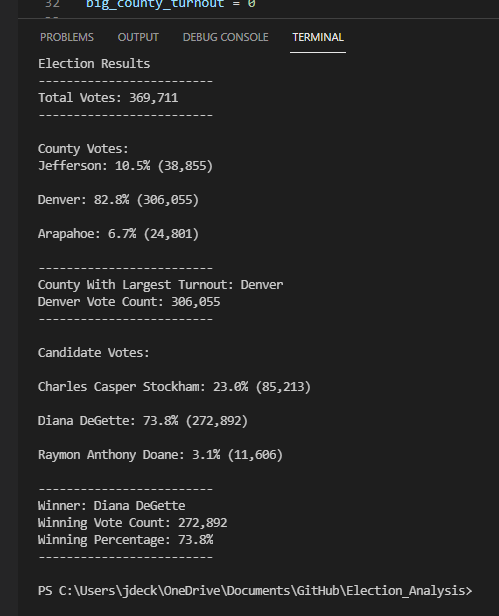

# stock-analysis

## Overview of Project

### The purpose of this analysis is to create a program that can be used to examine a set of election results to determine a couple different things. First we wanted to figure out how many votes each candidate received in the election and use that data to determine a winner. Secondly we wanted establish how many votes were cast in each of the couties in the dataset, and which county represented the most votes.

## Election-Audit Results

### In order to analyze this election we used a dataset consiting of only three columns of data. A Ballot ID, Which County the ballot was cast in, and who the ballot was cast for. This data can be used to determine the winner of the election as well as other interesting information. Below you can see some of the conclusions we can make, and I will explain how I calculated it.
  -  All of the analysis here was achived by looking at the data in the data set line by line. Since each line represnts a vote, by counting the number of lines we look at we are also counting the number of votes. I simply created a variable at the beginning of the algorithm called total_votes and set it to 0 *(line 14[^1]: total_votes = 0)*. Then everytime the program looked at a new line it added one to that total_votes *(line 46[^1]: total_votes = total_votes + 1)*. Doing this told us the total number of votes cast was **369,711**
  -  Going through the data line by line also allowed us to make a list of the different counties in which votes were cast for the election. I also created a dictioary to keep track of how many votes each county represented. *(line 21-22[^1])*. As the program looks at each row it checks if that county has been seen before, and adds it to the list if needed. It also adds one to the count of the number of times we have seen that county *(line 69-78[^1])*. With this method we calculate there were **3** different counties in which votes were cast: Jefferson, Denver, Arapahoe. The votes break down as follows...
     * **Jefferson** received **38,855** votes, for **10.5%** of the total votes cast 
     * **Denver** received **306,055** votes, for **82.8%** of the total votes cast 
     * **Arapahoe** received **24,801** votes, for **6.7%** of the total votes cast
  -  By looping through the dictionary of counties I created we can compare the votes cast and decide which County represents the most votes *(line 96-109[^1])*. Doing this for this data shows us that by far **Denver** represented the most votes, with **82.8** percent of the toal votes cast, or **306,055** votes.
  -  Using the same logic used in calucating County votes we can also calculate Candidate votes. We utilize a list and dictionary *(line 17-18[^1])* then adding to those when needed *(line 56-65[^1])*. This tells us there were **3** different candidates in this election who received votes: Charles Casper Stockham, Diana DeGette, Raymon Anthony Doane. The votes break down as follows...
     * **Charles Casper Stockham** received **85,213** votes, for **23.0%** of the total votes cast 
     * **Diana DeGette** received **272,892** votes, for **73.8%** of the total votes cast 
     * **Raymon Anthony Doane** received **11,606** votes, for **3.1%** of the total votes cast
  -  Just like with the counties, by looping through the dictionary of cadidates we can calculate the winner of the election *(line 125-142[^1])*. Doing this we see that **Diana DeGette** was the clear winner of this election, with **73.8%** of the total votes cast going to her. That's **272,892** votes that she received.

Below you can see a terminal printout of this summary of the data...

## Summary

  Re

[^1]:  [Refers to file PyPoll.py](PyPoll.py)
